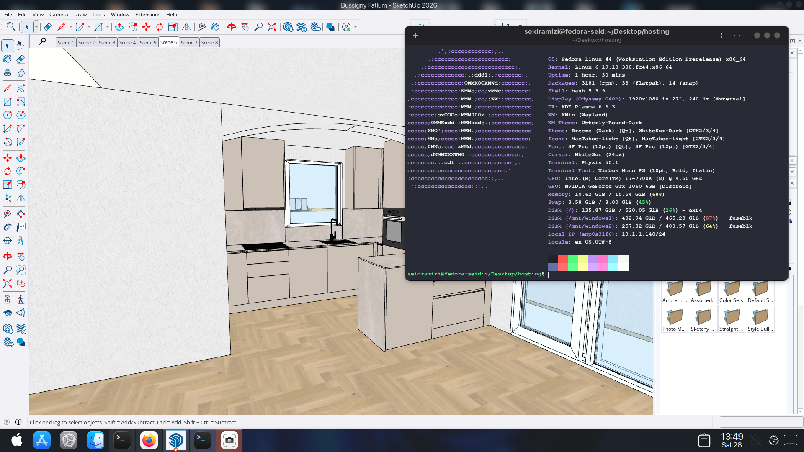

# 🏛️ SketchUp 2026 for Linux (NVIDIA & AMD Optimized)

---

## 📸 Showcase


---

## 📦 Download Links
🚀 **[Download UNIVERSAL Version (Recommended)](https://mega.nz/file/HgJmDSbY#h4JhUNr_zjbHcJtjzkULqVQag6_rz1v7QUQ3B4NvlD0)**  
*(Best for AMD, Intel, and modern NVIDIA setups)*

🟢 **[Download NVIDIA ONLY Version (Legacy)](https://mega.nz/file/S04E0D4J#vAVYb51tAd5VKcoarW4MMDOejuEsA_1MF3NmL7R6kKY)**  
*(Optimized specifically for dedicated NVIDIA cards)*

---

## ⚠️ Prerequisites
You **must** have Wine and Winetricks installed before running the installer:
- **Ubuntu/Mint:** `sudo apt install wine winetricks -y`
- **Fedora:** `sudo dnf install wine winetricks -y`

---

## 📦 Installation Guide
1. **Download & Extract** the ZIP file.
2. **Open Terminal** inside the extracted folder.
3. **Run the Setup Script:**
   ```bash
   chmod +x install.sh
   ./install.sh
   ```
4. **Desktop Icon:** Copy the provided `SketchUp.desktop` file to your applications folder:
   ```bash
   cp SketchUp.desktop ~/.local/share/applications/
   ```

---

## 🛠️ GPU Specific Fixes
- **NVIDIA:** The launcher is pre-configured. If graphics are greyed out, ensure Proprietary Drivers are installed.
- **AMD/Intel:** Works natively with Mesa drivers. Use `DRI_PRIME=1` for Hybrid Laptops.

---

## 🔥 Quick Fix for Common Issues
If SketchUp hangs at the **Welcome Screen**, run this inside the package folder:

```bash
# 1. Close processes
wineserver -k

# 2. Skip Welcome screen
WINEPREFIX=$HOME/.sketchup2026 wine reg add "HKEY_CURRENT_USER\Software\SketchUp\SketchUp 2026\Common" /v "ShowWelcomeWindow" /t REG_DWORD /d 0 /f

# 3. Re-apply Activation
mkdir -p "$HOME/.sketchup2026/dosdevices/c:/Program Files/SketchUp/SketchUp 2026/SketchUp"
cp crack/SketchUp.exe "$HOME/.sketchup2026/dosdevices/c:/Program Files/SketchUp/SketchUp 2026/SketchUp/SketchUp.exe"
```

---

## 🤝 Contact
**Seid Ramizi** - seid.cincin@gmail.com
